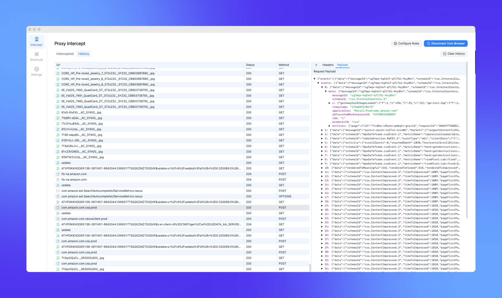
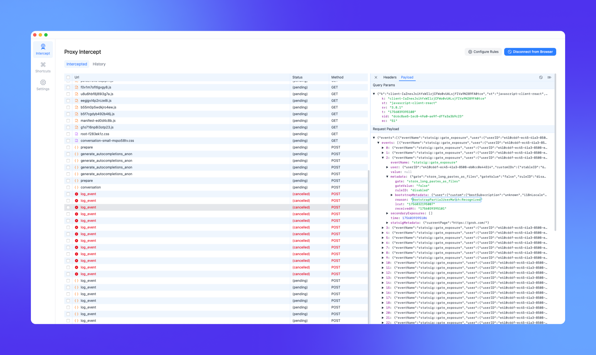
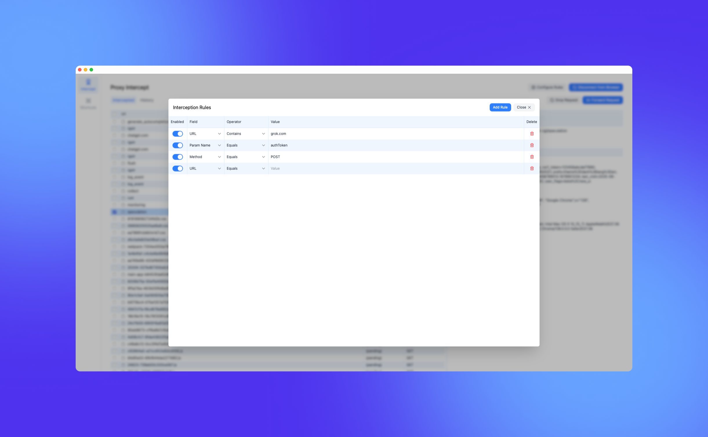
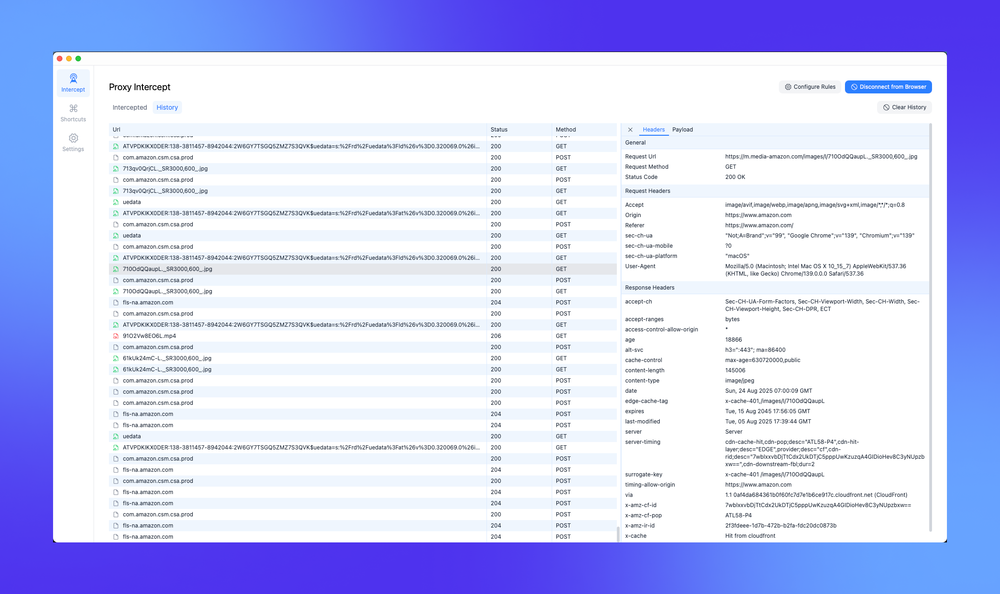

# ⚡ HTTP Interceptor

A modern HTTP traffic interceptor and modifier. Tired of using BurpSuite's outdated UI to modify requests? Me too! This project implements a UI that matches
the experience of Chrome's DevTools, so you can feel right at home!

## Table of Contents

- [Features](#features)
  - [View all traffic going in and out of your browser](#view-all-traffic-going-in-and-out-of-your-browser)
  - [Hold requests, modify their content, or drop them](#hold-requests-modify-their-content-or-drop-them)
  - [Create rules to intercept and modify specific requests](#create-rules-to-intercept-and-modify-specific-requests)
  - [View all past requests](#view-all-past-requests)
- [Project Structure](#project-structure)

## Features

### View all traffic going in and out of your browser

### Hold requests, modify their content, or drop them

### Create rules to intercept and modify specific requests

### View all past requests

## Project Structure

| Folder        | Description                                                                                                    |
| ------------- | -------------------------------------------------------------------------------------------------------------- |
| `ui`          | The frontend for the application, using react                                                                  |
| `bridge`      | The tauri bridge that handles communication between the frontend and the backend                               |
| `interceptor` | Custom chrome devtools protocol (CDP) implementation, which manages connections to CDP, and handles all events |
| `shared`      | Shared logic between `interceptor` and `ui` including network stores, rule stores, common types, and more      |
