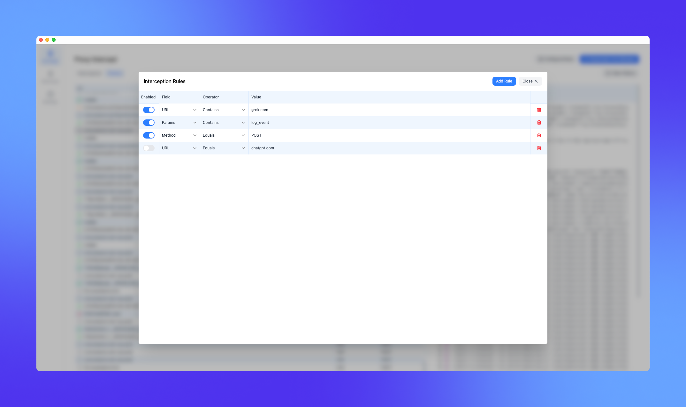

# HTTP Interceptor

A modern HTTP traffic interceptor and modifier.

### View all traffic going in and out of your browser

### Hold requests, modify their content, or drop them

### Create rules to intercept and modify specific requests

### View all past requests

